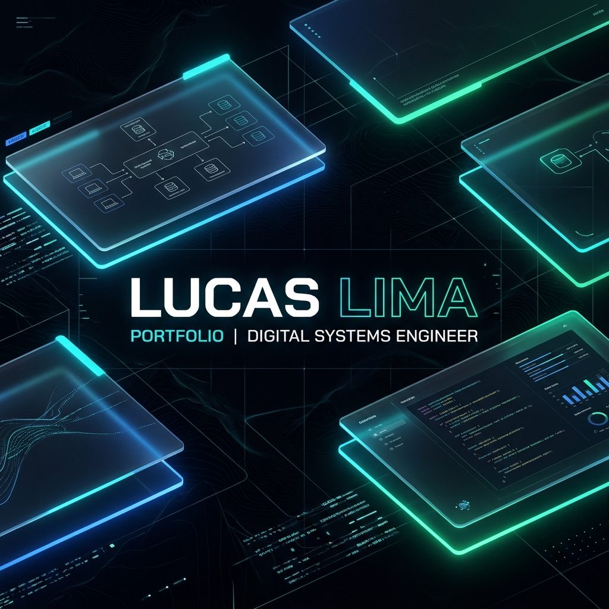
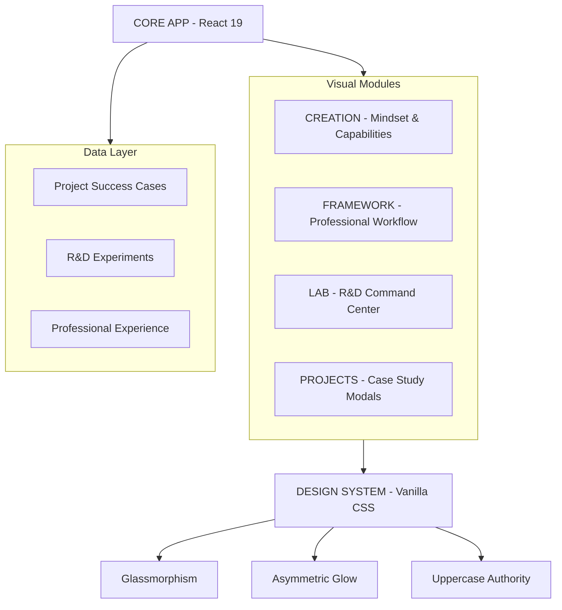

# LUCAS LIMA | DIGITAL SYSTEMS ENGINEER 🚀

> **"Construir sem entender é só execução. Construir com visão é o que transforma produto em resultado."**

Este repositório é um ecossistema de engenharia digital projetado para demonstrar a fusão entre **Arquitetura de Software**, **UX Estratégica** e **Visual Design de Alta Fidelidade**.

---

## 🏛️ ARQUITETURA VISUAL DO SISTEMA

Abaixo, a representação da estrutura modular que sustenta o portfólio, garantindo escalabilidade e performance:



---

## 🛠️ O QUE ESTAMOS USANDO (TECH STACK COMPLETA)

| Categoria | Tecnologias & Ferramentas | Propósito |
| :--- | :--- | :--- |
| **Engine** | React 19 + Vite | Performance de renderização e build ultra-rápido. |
| **Animation** | Framer Motion | Orquestração de micro-interações e transições fluídas. |
| **Design** | Vanilla CSS + CSS Modules | Controle total sobre UI sem dependências externas. |
| **Data & Cloud** | Supabase Storage | Entrega de ativos (imagens/vídeos) via CDN. |
| **Icons** | Lucide React | Iconografia técnica de alta legibilidade. |
| **IA Engine** | Gemini 1.5 Flash | Suporte inteligente para geração e análise de conteúdo. |

---

## 🎨 DESIGN SYSTEM: HI-TECH AUTHORITY

O projeto é guiado por um **Design System proprietário** focado em autoridade visual:

- **[ 🔷 ] Glassmorphism**: Camadas translúcidas que criam profundidade.
- **[ ⚡ ] Asymmetric Aura**: Iluminação perimétrica que guia a atenção do usuário.
- **[ 🏛️ ] Uppercase Standard**: Tipografia em maiúsculas para um tom sério e industrial.
- **[ 🛰️ ] Telemetry UI**: Elementos decorativos que simulam interfaces de comando.

---

## 📈 EVOLUÇÃO E ROADMAP (V2.6.5)

O portfólio evoluiu de uma landing page simples para um **Dashboard de Engenharia**:

- **Fase 01 (Foundation)**: Estrutura React básica e CSS modularizado.
- **Fase 02 (Premium Overhaul)**: Implementação de efeitos visuais avançados e "Modo Recrutador".
- **Fase 03 (System Thinking)**: Criação das seções `Creation` e `Framework`, focando em metodologia.
- **Fase 04 (Authority Standardization)**: Padronização total em maiúsculas e refatoração semântica completa.
- **Sincronização Cromática Estratégica**: Sistema de cores unificado (Azul/Ciano/Verde).
- **Refinamento de Telemetria**: Implementação de status dinâmicos por módulo, com destaque para o **FULL CYCLE ACTIVE** na fase de **Expansão**, sinalizando a maturidade máxima do sistema.

---

## 🚀 COMO EXECUTAR O SISTEMA

```bash
# Clone e instalação
git clone https://github.com/seu-usuario/lucas-lima-digital.git
npm install

# Execução (Modo Dev)
npm run dev
```

---

*Desenvolvido com excelência técnica por Lucas Lima.*
