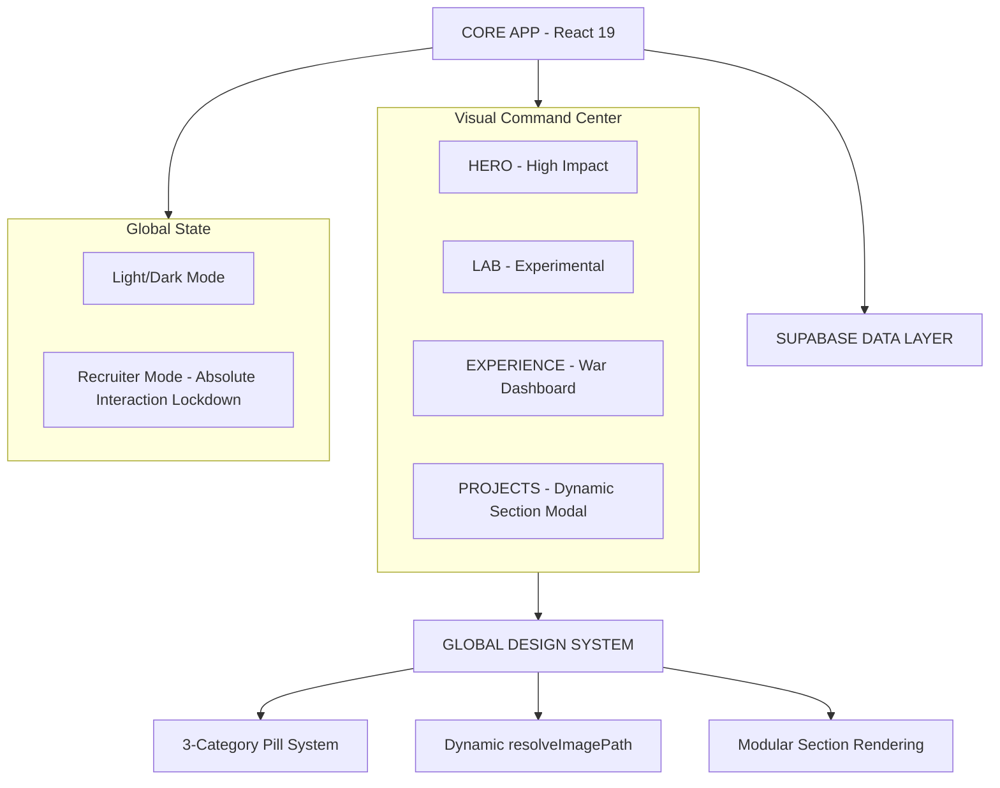

# 🏛️ LUCAS LIMA | DIGITAL SYSTEMS & PRODUCTS ENGINEER
### `INDUSTRIAL STANDARD V6.0.7` • `DYNAMIC CASE ARCHITECTURE`

> **"Sistemas não começam no código. Começam no entendimento do negócio."**
> A engenharia digital de alta performance é a arte de transformar caos operacional em estrutura, controle e resultado mensurável.

---

## 🛰️ VISÃO GERAL DO ECOSSISTEMA
Este não é apenas um portfólio. É um **Dashboard de Engenharia** projetado para demonstrar a fusão entre arquitetura de software escalável, UX estratégica e uma estética de "Autoridade Industrial". Cada componente foi desenvolvido sob a premissa de que a interface deve respirar precisão e clareza técnica.

| CATEGORIA | TECNOLOGIA | PROPÓSITO INDUSTRIAL |
| :--- | :--- | :--- |
| **ENGINE** | `React 19 + Vite` | Ciclo de renderização otimizado e build-time ultra-reduzido. |
| **STORAGE** | `Supabase Storage` | Gestão de assets com resolução dinâmica de buckets (`bucket:path`). |
| **CASE ARCH** | `Dynamic Section System` | Cada projeto possui narrativa única via array modular de `sections`. |
| **INTELLIGENCE** | `Gemini AI + Custom Hook` | Processamento semântico e suporte à decisão em tempo real. |
| **TYPOGRAPHY** | `Fluid CSS (clamp)` | Escaneabilidade perfeita e ausência de cortes de texto em qualquer device. |
| **PREMIUM UX** | `Fluid Carousel (12s/2.5s)` | Transição estendida para leitura técnica profunda de cases complexos. |
| **THEME ENGINE** | `Light/Dark 2.0` | Sistema de contraste adaptativo com degradês premium e acessibilidade auditada. |
| **ICONOGRAPHY** | `PillIcon Dynamic System` | Abstração de ícones com mapeamento semântico por categoria. |

---

## 🏛️ ARQUITETURA DE SISTEMA (S.A.P - SEMANTIC ARCHITECTURE PATTERN)

Abaixo, o fluxo de dados que garante a integridade e a escalabilidade do sistema:



---

## 🎨 FILOSOFIA DE DESIGN: "DASHBOARD DE GUERRA 2.0"
O sistema visual evoluiu para suportar múltiplos contextos de leitura sem perder a **Autoridade**.

*   **[ 🎯 ] Recruiter Mode (Absolute Neutralization)**: Trava global que suprime 100% de transformações, filtros, letter-spacing e animações do logo, garantindo uma interface estática de alta densidade informativa.
*   **[ 🔄 ] High-Retention Carousel**: Pausa de 12 segundos e transição fluida de 2.5 segundos, projetada para permitir que o usuário processe as métricas e o impacto de cada case.
*   **[ 🧩 ] Modular Case Narratives**: O sistema de `sections` (Texto, Pilares, Roadmap, Galeria, Links) permite que cada projeto conte sua história de forma personalizada e tecnicamente densa.
*   **[ 🌊 ] Fluid Layouts & Typography**: Uso extensivo de `clamp()` para garantir que títulos monumentais de 5.5rem se ajustem perfeitamente a telas mobile sem clipping.
*   **[ 🖼️ ] Intelligent Asset Resolution**: O utilitário `resolveImagePath` agora suporta prefixos de bucket (ex: `divinosapore:file.png`), permitindo gestão multi-projeto escalável.

---

## 📈 EVOLUÇÃO E ROADMAP (V6.0.0 - HYBRID ENGINE & THEME OVERHAUL)

### 📅 CHANGELOG TÉCNICO

*   **v6.0.7 (ATUAL)**:
    *   `DYNAMIC_CASE_ARCHITECTURE`: Migração de todos os cases para o sistema de `sections` modulares.
    *   `CAROUSEL_UX_REFINEMENT`: Ajuste fino de timings (12s pause / 2.5s transition) para leitura premium.
    *   `RECRUITER_MODE_V3`: Neutralização absoluta de hover effects e cursor pointer no brand logo.
    *   `MULTI_BUCKET_SUPPORT`: Upgrade no resolvedor de imagens para suportar sintaxe `bucket:path`.
    *   `DEPLOY_CI_CD_FIX`: Resolução de conflitos de dependência ESLint para compatibilidade total com Vercel Build.
*   **v6.0.6**:
    *   `MOBILE_ARCH_OPTIMIZATION`: Re-arquitetura total de grids para mobile (Experience & Lab).
    *   `FLUID_TYPOGRAPHY_STABILIZATION`: Refinamento global de `clamp()` em títulos de seções.
    *   `UI_OVERFLOW_RESOLUTION`: Supressão absoluta de scroll horizontal.
*   **v6.0.4**:
    *   `RECRUITER_MODE_LOCKDOWN`: Implementação de estado estático absoluto para a logo.
    *   `OFFICIAL_BRAND_SVG`: Sincronização automática entre variantes de logo e tema atual.
*   **v5.3.0**: Implementação do `SYSTEM_ACCESS` com Panoramic Terminal.
*   **v3.0.0**: Migração para React 19 e orquestração de animações.

---

## 🚀 EXECUÇÃO DO AMBIENTE

Para rodar este ecossistema localmente e observar a arquitetura em tempo real:

```powershell
# 1. Clonar o Repositório de Elite
git clone https://github.com/lukaslimna1/Lucas-Lima-Digital.git

# 2. Inicializar Dependências
npm install

# 3. Disparar o Motor de Desenvolvimento
npm run dev
```

---

> **DESENVOLVIDO COM RIGOR TÉCNICO E VISÃO ESTRATÉGICA.**
> *Lucas Lima — Digital Systems Engineer*
