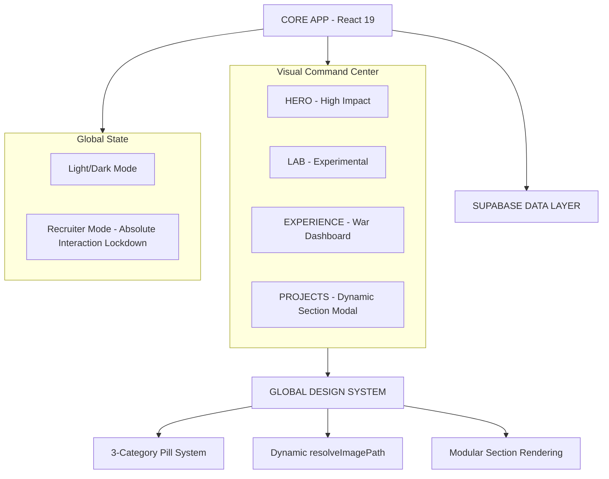

# 🏛️ LUCAS LIMA | DIGITAL SYSTEMS & PRODUCTS ENGINEER
### `INDUSTRIAL STANDARD v6.9.0` • `DYNAMIC CASE ARCHITECTURE`

> **"Sistemas não começam no código. Começam no entendimento do negócio."**
> A engenharia digital de alta performance é a arte de transformar caos operacional em estrutura, controle e resultado mensurável.

---

## 🛰️ VISÃO GERAL DO ECOSSISTEMA
Este não é apenas um portfólio. É um **Dashboard de Engenharia** projetado para demonstrar a fusão entre arquitetura de software escalável, UX estratégica e uma estética de "Autoridade Industrial". Cada componente foi desenvolvido sob a premissa de que a interface deve respirar precisão e clareza técnica.

| CATEGORIA | TECNOLOGIA | PROPÓSITO INDUSTRIAL |
| :--- | :--- | :--- |
| **META-ARCH** | `Portfolio Architecture` | Seção dedicada à engenharia interna do ecossistema Lucas Lima. |
| **ENGINE** | `React 19 + Vite` | Ciclo de renderização otimizado e build-time ultra-reduzido. |
| **TOUCH UX** | `Swipe Engine (Framer)` | Navegação por gestos (swipe) no carrossel de projetos para fluidez mobile. |
| **STORAGE** | `Supabase Storage` | Gestão de assets com resolução dinâmica de buckets (`bucket:path`). |
| **CASE ARCH** | `Dynamic Section System` | Cada projeto possui narrativa única via array modular de `sections` (10+ seções). |
| **PRE-SYSTEM** | `Boot Preloader` | Sequência de boot industrial para carregamento camuflado de assets. |
| **VISUAL STD** | `Uppercase Authority` | Padronização de títulos em caixa alta para máxima autoridade visual. |
| **ERROR CTRL** | `NotFound System` | Página 404 customizada com estética de erro crítico de sistema. |
| **INTELLIGENCE** | `Gemini AI + Custom Hook` | Processamento semântico e suporte à decisão em tempo real. |

---

## 🏛️ ARQUITETURA DE SISTEMA (S.A.P - SEMANTIC ARCHITECTURE PATTERN)

Abaixo, o fluxo de dados que garante a integridade e a escalabilidade do sistema:



---

## 🎨 FILOSOFIA DE DESIGN: "DASHBOARD DE GUERRA 2.0"
O sistema visual evoluiu para suportar múltiplos contextos de leitura sem perder a **Autoridade**.

*   **[ 🎯 ] Recruiter Mode (Absolute Neutralization)**: Trava global que suprime 100% de transformações, filtros, letter-spacing e animações do logo, garantindo uma interface estática de alta densidade informativa.
*   **[ 🔄 ] High-Retention Carousel**: Pausa de 12 segundos e transição fluida de 2.5 segundos, projetada para permitir que o usuário processe as métricas e o impacto de cada case.
*   **[ 🖐️ ] Touch-First Navigation**: Implementação de `dragMomentum` e `swipeThreshold` para navegação intuitiva em dispositivos touch.
*   **[ 🧩 ] Modular Case Narratives**: O sistema de `sections` (Texto, Pilares, Roadmap, Galeria, Links) permite que cada projeto conte sua história de forma personalizada e tecnicamente densa.
*   **[ 🌊 ] Fluid Layouts & Typography**: Uso extensivo de `clamp()` para garantir que títulos monumentais de 5.5rem se ajustem perfeitamente a telas mobile sem clipping.
*   **[ 🖼️ ] Intelligent Asset Resolution**: O utilitário `resolveImagePath` agora suporta prefixos de bucket (ex: `divinosapore:file.png`), permitindo gestão multi-projeto escalável.

---

## 📈 EVOLUÇÃO E ROADMAP (V6.7.0 - MOBILE UX & RESILIENCE)

### 📅 CHANGELOG TÉCNICO

*   **v6.9.0 (Wolf Pack Evolution & Meta-Arch)**:
    *   `WOLF_PACK_REFACTOR`: Case study reconstruído com narrativa de "Sistema de Evolução" e 11 seções de alta densidade.
    *   `META_PORTFOLIO_CASE`: Lançamento do case "The Architecture", documentando a stack técnica do próprio ecossistema.
    *   `VISUAL_UPPERCASE_STD`: Padronização de todos os títulos de cards (Projects, Lab, Creation) para Uppercase.
    *   `ROUTING_RESILIENCE`: Correção de navegação cross-page via caminhos absolutos na Sidebar e 404.
*   **v6.8.0 (System Infrastructure & Resilience)**:
    *   `META_PORTFOLIO_INIT`: Registro do projeto arquitetural no carrossel principal.
    *   `SIDEBAR_ROUTING_FIX`: Implementação de caminhos absolutos para navegação resiliente a partir de sub-rotas.
    *   `DATA_INTEGRITY`: Sincronização de stores (`data.js` e `data/index.js`) para eliminação de shadow data.
*   **v6.7.0 (Mobile UX & Resilience Overhaul)**:
    *   `TOUCH_SWIPE_CAROUSEL`: Implementação de gestos (swipe) no carrossel de projetos usando `framer-motion` drag API.
    *   `MOBILE_INTERACTION_FIX`: Resolução de conflitos de clique em modais (backdrop vs links) via `target check` e `e.stopPropagation()`.
    *   `WEBKIT_COMPATIBILITY`: Padronização de prefixos `-webkit-` para máscaras, filtros de vidro e gradientes em Safari/iOS.
    *   `RESILLIENT_ICON_FALLBACK`: Sistema de renderização em cascata (FontAwesome -> Lucide -> Generic) para garantir UI inquebrável.
*   **v6.6.0 (Design System Standardization)**:
    *   `LIGHT_MODE_2.0`: Paridade visual absoluta entre temas com tokens semânticos e glassmorphism otimizado.
    *   `SEMANTIC_CATEGORIES`: Implementação de cores categóricas dinâmicas (Estratégia, Técnica, Futuro) no módulo de Stack.
    *   `SIDEBAR_UX_FIX`: Estabilização de alinhamento e remoção de "dark leaks" em botões interativos no modo claro.
*   **v6.5.3 (Expansão de Conteúdo)**:
    *   `STACK_TOOLS_MODULE`: Nova seção dedicada a especificações técnicas, arquitetura de frontend/backend e ferramentas de design.
*   **v6.5.2 (Resiliência & Fault Tolerance)**:
    *   `HITECH_ERROR_BOUNDARIES`: Implementação de sistema de contenção de falhas industriais para isolar erros de renderização em módulos específicos.
*   **v6.5.1 (Performance & Asset Optimization)**:
    *   `MEMO_ENGINE`: Memoização estratégica de componentes pesados (`Hero`, `Projects`) para redução de ciclos de renderização.
    *   `FONT_PRELOADING`: Otimização de LCP via preloading de fontes críticas e carregamento assíncrono de CSS.
*   **v6.5.0 (UX Progressiva & SEO)**:
    *   `BLUEPRINT_SKELETONS`: Loaders estéticos (estilo diagrama técnico) para eliminar Layout Shift.
    *   `JSONLD_SCHEMA`: Integração de dados estruturados para posicionamento como *Digital Product Builder*.
    *   `PWA_INTEGRATION`: Suporte offline e experiência instalável via `vite-plugin-pwa`.
*   **v6.4.0 (Filtro Semântico & UX Tooling)**:
    *   `SEMANTIC_FILTERING`: Sistema de categorização de projetos (Software, IA, Branding).
    *   `FLUID_UI_TRANSITIONS`: Uso de `layoutId` e `layout` do Framer Motion para transições de estado sem quebra de fluxo.
    *   `DYNAMIC_CAROUSEL_ADAPTATION`: Ajuste automático da lógica de loop infinito com base no volume de itens filtrados.
*   **v6.3.0 (Estabilização Mobile & Social)**:
    *   `SOCIAL_SEO_PORTUGUESE`: Localização de metadados OG/Twitter e caminhos absolutos para imagens.
    *   `CAROUSEL_PERFORMANCE`: Inicialização de estado otimizada no `Projects.jsx` para renderização instantânea.
    *   `MOBILE_UX_STABILIZATION`: Modais full-screen, ajustes de grid no Contato e Lab para iPhone SE.
    *   `MONITORING_INTEGRATION`: Implementação de **Vercel Analytics** e **Speed Insights** para monitoramento de performance e tráfego.
    *   `TECHNICAL_UI_POLISH`: Remoção de scrollbars nativas nos modais para estética limpa.
*   **v6.2.0**:
    *   `PREMIUM_UI_POLISH`: Refinamento de espaçamentos (Pills & Sections) nos Modais de Case.
    *   `SPACING_UTILITIES`: Implementação de classes de margem dinâmica (`mbLarge`, `mbMedium`) para ritmo visual.
    *   `UX_STABILIZATION`: Ajuste de gap em tech-tags para leitura premium.
*   **v6.0.9**:
    *   `BUILD_PIPELINE_OPTIMIZATION`: Migração para `esbuild` e otimização de chunks.
    *   `STABILITY_OVERHAUL`: Resolução definitiva de erros de build no Vercel.
    *   `RECRUITER_MODE_V3`: Neutralização absoluta de hover effects no brand logo.
*   **v6.0.6**:
    *   `MOBILE_ARCH_OPTIMIZATION`: Re-arquitetura total de grids para mobile (Experience & Lab).
    *   `FLUID_TYPOGRAPHY_STABILIZATION`: Refinamento global de `clamp()` em títulos de seções.
    *   `UI_OVERFLOW_RESOLUTION`: Supressão absoluta de scroll horizontal.
*   **v6.0.4**:
    *   `RECRUITER_MODE_LOCKDOWN`: Implementação de estado estático absoluto para a logo.
    *   `OFFICIAL_BRAND_SVG`: Sincronização automática entre variantes de logo e tema atual.
*   **v5.3.0**: Implementação do `SYSTEM_ACCESS` com Panoramic Terminal.
*   **v3.0.0**: Migração para React 19 e orquestração de animações.

---

## 🚀 EXECUÇÃO DO AMBIENTE

Para rodar este ecossistema localmente e observar a arquitetura em tempo real:

```powershell
# 1. Clonar o Repositório de Elite
git clone https://github.com/lukaslimna1/Lucas-Lima-Digital.git

# 2. Inicializar Dependências
npm install

# 3. Disparar o Motor de Desenvolvimento
npm run dev
```

---

> **DESENVOLVIDO COM RIGOR TÉCNICO E VISÃO ESTRATÉGICA.**
> *Lucas Lima — Digital Systems Engineer*
