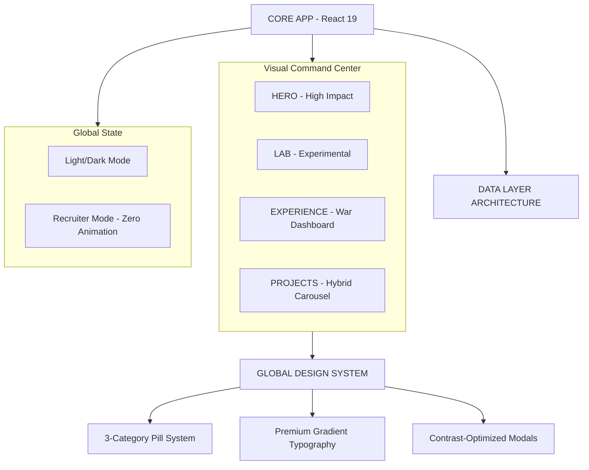

# 🏛️ LUCAS LIMA | DIGITAL SYSTEMS & PRODUCTS ENGINEER
### `INDUSTRIAL STANDARD V6.0.0` • `HYBRID EXPERIENCE ARCHITECTURE`

> **"Sistemas não começam no código. Começam no entendimento do negócio."**
> A engenharia digital de alta performance é a arte de transformar caos operacional em estrutura, controle e resultado mensurável.

---

## 🛰️ VISÃO GERAL DO ECOSSISTEMA
Este não é apenas um portfólio. É um **Dashboard de Engenharia** projetado para demonstrar a fusão entre arquitetura de software escalável, UX estratégica e uma estética de "Autoridade Industrial". Cada componente foi desenvolvido sob a premissa de que a interface deve respirar precisão e clareza técnica.

### 🛠️ CORE STACK (ESPECIFICAÇÕES TÉCNICAS)

| CATEGORIA | TECNOLOGIA | PROPÓSITO INDUSTRIAL |
| :--- | :--- | :--- |
| **ENGINE** | `React 19 + Vite` | Ciclo de renderização otimizado e build-time ultra-reduzido. |
| **DESIGN SYSTEM** | `Vanilla CSS + Modules` | Zero overhead de bibliotecas; controle total de cada pixel. |
| **INTELLIGENCE** | `Gemini AI + Custom Hook` | Processamento semântico e suporte à decisão em tempo real. |
| **HYBRID CAROUSEL** | `Framer Motion + Adaptive Logic` | Navegação contínua/infinita com transição suave entre modos Manual e Auto. |
| **THEME ENGINE** | `Light/Dark 2.0` | Sistema de contraste adaptativo com degradês premium e acessibilidade auditada. |
| **ICONOGRAPHY** | `PillIcon Dynamic System` | Abstração de ícones (Lucide + FontAwesome) com mapeamento semântico por categoria. |

---

## 🏛️ ARQUITETURA DE SISTEMA (S.A.P - SEMANTIC ARCHITECTURE PATTERN)

Abaixo, o fluxo de dados que garante a integridade e a escalabilidade do sistema:



---

## 🎨 FILOSOFIA DE DESIGN: "DASHBOARD DE GUERRA 2.0"
O sistema visual evoluiu para suportar múltiplos contextos de leitura sem perder a **Autoridade**.

*   **[ 🔄 ] Hybrid Infinite Carousel**: Rolagem fluida de 15-25s que respeita a interação do usuário, pausando sob demanda e retomando de forma inteligente.
*   **[ 🎯 ] Recruiter Mode (Zero Friction)**: Uma trava de segurança global que congela todas as animações e transições, transformando o dashboard em um documento estático de alta legibilidade.
*   **[ 💡 ] Light Mode 2.0**: Reestruturação total de contraste. Títulos em degradê (Deep Blue to Cyan) e boxes semânticos (`Problem`, `Impact`, `Insight`) adaptados para fundos claros.
*   **[ 🏷️ ] 3-Category Pills**: Cada projeto agora é classificado em 3 eixos: **Stack Técnica**, **Domínio de Negócio** e **Status/Valor**, facilitando a leitura rápida por recrutadores.

---

## 📈 EVOLUÇÃO E ROADMAP (V6.0.0 - HYBRID ENGINE & THEME OVERHAUL)

### 📅 CHANGELOG TÉCNICO

*   **v6.0.0 (ATUAL)**:
    *   `HYBRID_CAROUSEL_ENGINE`: Implementação de scroll infinito com transição suave e "resume timer" de 10 segundos.
    *   `GLOBAL_RECRUITER_FREEZE`: Sistema de trava absoluta para todas as animações via state drilling para `Projects` e `Lab`.
    *   `LIGHT_MODE_CONTRAST_REVISION`: Overhaul visual de todos os modais para suporte total ao modo claro com acessibilidade auditada.
    *   `DYNAMIC_PILL_SYSTEM`: Criação do `PillIcon` utility para mapeamento automático de ícones e categorização tríplice (Stack, Contexto, Status).
    *   `PREMIUM_GRADIENTS`: Introdução de tipografia em degradê (Blue-Cyan) para títulos de modal em Light Mode.
*   **v5.3.1**: Badge de acesso com Red Pulse e otimizações de footer.
*   **v5.3.0**: Implementação do `SYSTEM_ACCESS` com grid assimétrico e Panoramic Terminal.
*   **v5.2.0**: Overhaul da seção de Experiência com modais `Problem/Action/Impact`.
*   **v3.0.0**: Migração para React 19 e orquestração de animações.
*   **v1.0.0**: Lançamento da estrutura modular original.

---

## 🚀 EXECUÇÃO DO AMBIENTE

Para rodar este ecossistema localmente e observar a arquitetura em tempo real:

```powershell
# 1. Clonar o Repositório de Elite
git clone https://github.com/lukaslimna1/Lucas-Lima-Digital.git

# 2. Inicializar Dependências
npm install

# 3. Disparar o Motor de Desenvolvimento
npm run dev
```

---

> **DESENVOLVIDO COM RIGOR TÉCNICO E VISÃO ESTRATÉGICA.**
> *Lucas Lima — Digital Systems Engineer*
