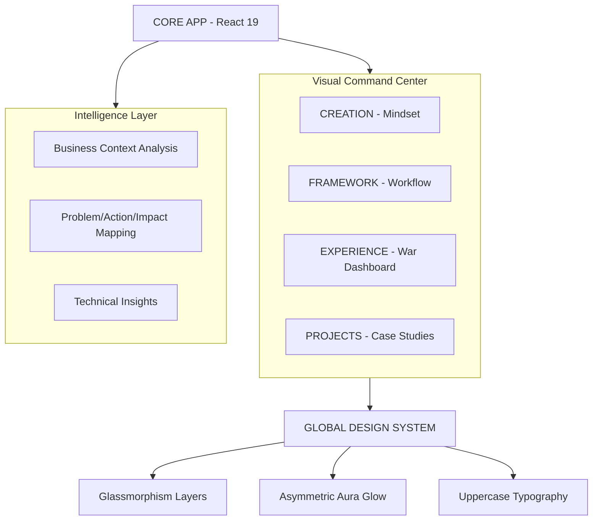

# 🏛️ LUCAS LIMA | DIGITAL SYSTEMS ENGINEER
### `INDUSTRIAL STANDARD V5.2.0` • `HIGH-FIDELITY ARCHITECTURE`

> **"Sistemas não começam no código. Começam no entendimento do negócio."**
> A engenharia digital de alta performance é a arte de transformar caos operacional em estrutura, controle e resultado mensurável.

---

## 🛰️ VISÃO GERAL DO ECOSSISTEMA
Este não é apenas um portfólio. É um **Dashboard de Engenharia** projetado para demonstrar a fusão entre arquitetura de software escalável, UX estratégica e uma estética de "Autoridade Industrial". Cada componente foi desenvolvido sob a premissa de que a interface deve respirar precisão e clareza técnica.

### 🛠️ CORE STACK (ESPECIFICAÇÕES TÉCNICAS)

| CATEGORIA | TECNOLOGIA | PROPÓSITO INDUSTRIAL |
| :--- | :--- | :--- |
| **ENGINE** | `React 19 + Vite` | Ciclo de renderização otimizado e build-time ultra-reduzido. |
| **DESIGN SYTEM** | `Vanilla CSS + Modules` | Zero overhead de bibliotecas; controle total de cada pixel. |
| **INTELLIGENCE** | `Gemini 1.5 Flash` | Processamento semântico para análise de contextos de negócio. |
| **ARCHITECTURE** | `Modular Data-Driven` | Separação total entre a camada de dados (`data.js`) e visual. |
| **ANIMATION** | `Framer Motion` | Micro-interações que reforçam a percepção de fluidez e luxo. |
| **CLOUD INFRA** | `Supabase + CDN` | Gestão de ativos e persistência com latência global mínima. |

---

## 🏛️ ARQUITETURA DE SISTEMA (S.A.P - SEMANTIC ARCHITECTURE PATTERN)

Abaixo, o fluxo de dados que garante a integridade e a escalabilidade do sistema:



---

## 🎨 FILOSOFIA DE DESIGN: "DASHBOARD DE GUERRA"
O sistema visual foi construído para transmitir **Autoridade e Estabilidade**. Não usamos cores genéricas; usamos tokens de design que reforçam a legibilidade técnica.

*   **[ 🧊 ] Glassmorphism 2.0**: Camadas translúcidas com `backdrop-filter` para profundidade imersiva.
*   **[ ⚡ ] Dynamic Auras**: Cada experiência possui sua própria identidade cromática (Matrix Green, Cobalt Blue, Tech Pink).
*   **[ 🏛️ ] Uppercase Authority**: Tipografia em maiúsculas para eliminar ruído e focar na informação bruta.
*   **[ 📊 ] Reflective Containers**: Caixas de conteúdo com efeitos de brilho assimétrico que guiam a leitura.

---

## 📈 EVOLUÇÃO E ROADMAP (V5.2 - INDUSTRIAL RELEASE)

O projeto evoluiu através de ciclos rigorosos de refatoração para atingir o estado de **Fidelidade Premium**:

### 📅 CHANGELOG TÉCNICO

*   **v5.2.0 (ATUAL)**: 
    *   `EXPERIENCE OVERHAUL`: Implementação do grid 2x2 simétrico e modais de alta fidelidade.
    *   `UI HIGHLIGHTS`: Criação das caixas reflexivas `ProblemBox`, `ImpactBox` e `InsightBox`.
    *   `SYNC ENGINE`: Paridade total de design entre os módulos de Projetos e Experiências.
*   **v4.5.0**: Padronização global de tipografia e centralização de tokens de design em `index.css`.
*   **v3.0.0**: Migração para React 19 e implementação de animações de entrada orquestradas.
*   **v1.0.0**: Nascimento da estrutura modular e design focado em "Authority".

---

## 🚀 EXECUÇÃO DO AMBIENTE

Para rodar este ecossistema localmente e observar a arquitetura em tempo real:

```powershell
# 1. Clonar o Repositório de Elite
git clone https://github.com/seu-usuario/lucas-lima-digital.git

# 2. Inicializar Dependências
npm install

# 3. Disparar o Motor de Desenvolvimento
npm run dev
```

---

> **DESENVOLVIDO COM RIGOR TÉCNICO E VISÃO ESTRATÉGICA.**
> *Lucas Lima — Digital Systems Engineer*
